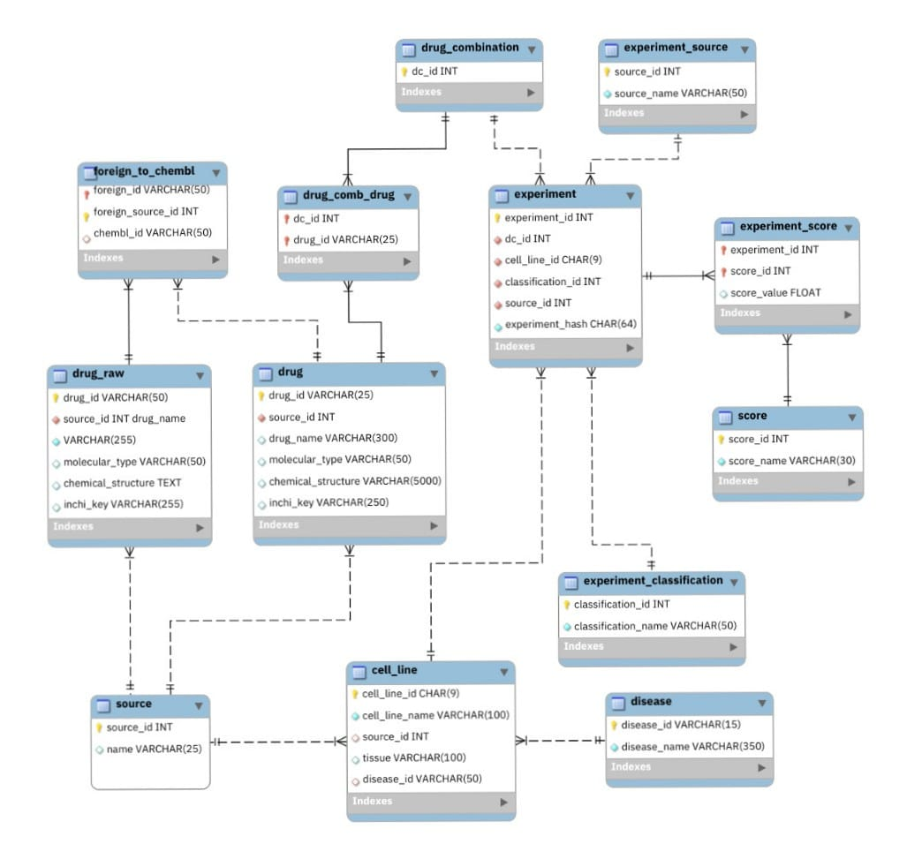

# DISNET drug combinations data integration

This repository contains the **pharmacological data integration and processing system** developed as part of the research at the **MEDAL** (Medical Data Analytics Laboratory).

The main objective is the extraction, transformation, and loading (ETL) of drug combination data (sourced from platforms like **DrugCombDB** and **DrugComb**) to build a **heterogeneous graph**. This graph will serve as the foundation for training Artificial Intelligence models (specifically **GNNs**) capable of predicting drug synergy and adverse effects.

## DrugCombDB
[DrugCombDB](https://drugcombdb.denglab.org/) is a comprehensive database of drug combinations for cancer therapy, integrating data from high-throughput screening studies, external databases, and manual curation from scientific literature.

We use their API to extract drug combination data with the following pipeline:
 

First, we extract the drug combination data from the DrugCombDB API. Then, we go into three main sub-pipelines:

### Drug Pipeline
DrugCombDB provides drug information using PubChem names. We map these names to **ChEMBL IDs** by extracting the PubChem IDs from DrugCombDB, then we use UniChem's API to map PubChem IDs to ChEMBL IDs. Finally, we extract drug features from ChEMBL using their API.

### Cell Line and Disease Pipeline
DrugCombDB provides the cell line's name used in the experiments. We extract the cellosaurus accession number using the DrugCombDB API. With this info, we can extract the associated disease's NCIt accession using the Cellosaurus API. With the NCIt accession, we extract the UMLS CUI using the UMLS API.

### Score Pipeline
DrugCombDB provides different synergy scores for each drug combination. We use these scores to calculate the experiment classification.

### Main Pipeline
Finally, we persist all the extracted and transformed data into DISNET, and create the drug_combination, drug_comb_drug, experiment, and experiment_score in DISNET.

## New tables in DISNET's Drugslayer
We have created new tables in DISNET's Drugslayer to store the drug combination data, as shown in the following diagram:
 

## Future work
We have successfully integrated drug combination data from DrugCombDB. However, DrugCombDb has over 500k drug combinations, so we have yet to plan how to integrate all this data efficiently.
To do it, we will make a better, more efficient caching system for the cell line and disease pipeline, as these are the pipelines that require more API calls.  
Here is a simple TODO list of the planned improvements:
- [ ] Implement a cache object to handle caching logic and storage.
- [ ] Implement a caching system for cell lines and diseases to minimize redundant API calls.
- [ ] Implement a caching system for drugs to minimize redundant API calls. 

We also plan to integrate data from other drug combination sources, such as DrugComb, to enrich our dataset and improve the performance of our AI models.